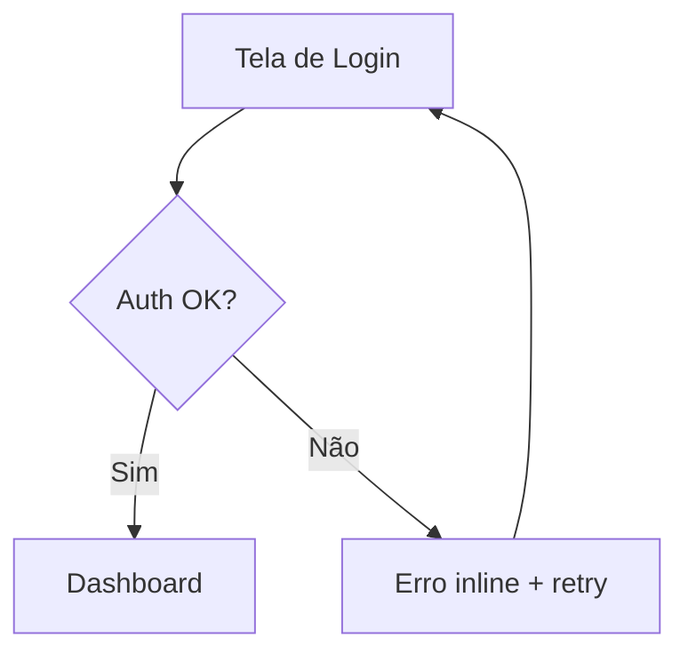

# prototype-spec

## Purpose

Especificar protótipos de alta fidelidade para telas e fluxos do produto — com anotações de comportamento, estados, responsividade e transições. O output é uma spec textual completa que serve tanto para validação com stakeholders quanto como referência para o handoff com @dev.

---

## Task Definition

```yaml
task: prototypeSpec()
responsible: Pixel (Product Designer & Design System Architect)
atomic_layer: Template

inputs:
  - campo: scope
    tipo: string
    origem: User Input
    obrigatório: true
    descrição: "Tela ou fluxo a especificar (ex: 'tela de login', 'fluxo de onboarding', 'dashboard principal')"

  - campo: user_goal
    tipo: string
    origem: User Input
    obrigatório: true
    descrição: "O que o usuário quer realizar nesta tela/fluxo"

  - campo: platform
    tipo: enum
    valores: [web, mobile, responsive]
    default: responsive
    obrigatório: false
    descrição: "Plataforma alvo"

  - campo: existing_tokens
    tipo: boolean
    default: false
    obrigatório: false
    descrição: "Já existe token file para este projeto? Se sim, Pixel referenciará os tokens."

outputs:
  - campo: prototype_spec
    tipo: markdown
    destino: Response
    descrição: "Especificação completa da tela/fluxo com layout, componentes, estados e comportamentos"

  - campo: flow_diagram
    tipo: markdown (mermaid)
    destino: Response
    descrição: "Diagrama de fluxo de navegação entre estados e telas"
```

---

## Workflow

### Passo 1 — Entender o Contexto

Elicitar antes de especificar:
1. Quem é o usuário desta tela? (persona ou papel)
2. De onde ele vem e para onde vai após esta tela?
3. Qual a ação principal (primary action) desta tela?
4. Existem restrições técnicas ou de plataforma relevantes?
5. Existe referência visual (concorrente, inspiração)?

### Passo 2 — Definir Estrutura de Layout

Especificar em texto estruturado:

```
LAYOUT — [Nome da Tela]
Breakpoints: mobile (375px) | tablet (768px) | desktop (1280px)

HEADER
  - Logo (esquerda) + Navigation (centro) + CTA primário (direita)
  - Sticky: sim | altura: 64px | background: color.surface.default

HERO / MAIN CONTENT
  - Grid: 12 colunas, gap 24px
  - Coluna principal: 8/12 | Sidebar: 4/12

FOOTER
  - ...
```

### Passo 3 — Especificar Componentes por Seção

Para cada componente na tela:
- Qual componente do design system usar (referência ao component index)
- Qual variante e estado inicial
- Qual token de espaçamento ao redor
- Comportamento em hover/focus/active

### Passo 4 — Mapear Estados da Tela

Documentar todos os estados possíveis:

| Estado | Trigger | UI Change | Feedback |
|--------|---------|-----------|---------|
| Loading | Submit do form | Botão desabilitado + spinner | — |
| Error | Resposta 4xx | Toast de erro + campo destacado | Mensagem inline |
| Success | Resposta 2xx | Redirect ou modal de confirmação | — |
| Empty | Sem dados | Ilustração + CTA para adicionar | — |

### Passo 5 — Especificar Responsividade

Para cada breakpoint crítico:
- O que some/aparece
- O que muda de posição (ex: sidebar vai para bottom)
- O que muda de tamanho (ex: headline 32px → 24px)

### Passo 6 — Diagrama de Fluxo

Produzir em Mermaid:



---

## Post-Conditions

```yaml
post-conditions:
  - [ ] Layout especificado para todos os breakpoints relevantes
  - [ ] Componentes identificados com variante e estado inicial
  - [ ] Todos os estados da tela documentados (loading, error, success, empty)
  - [ ] Diagrama de fluxo de navegação produzido
  - [ ] Spec pronta para ser usada como input do *handoff
```

---

## Metadata

```yaml
version: 1.0.0
tags: [prototype, spec, ux, layout, pixel, software-house-elite]
updated_at: 2026-04-18
```
